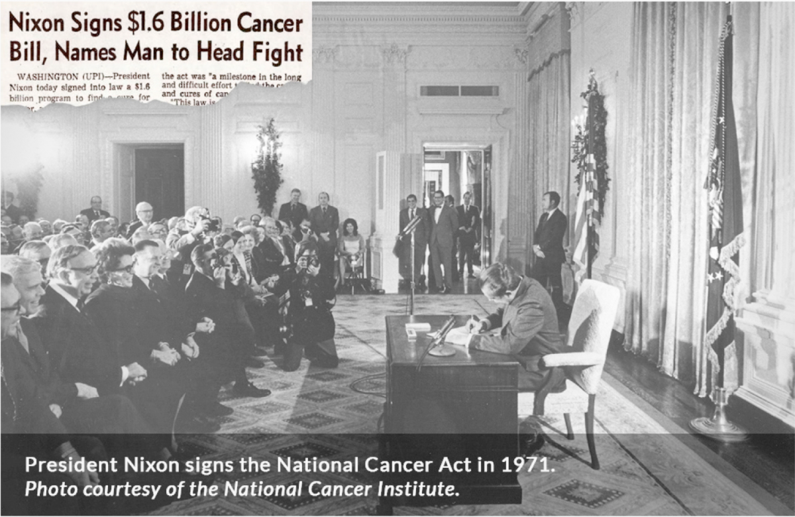

<left-top-navigation root="/about/"></left-top-navigation>

<h2 class="post-title">History of the President's Cancer Panel</h2>
The President's Cancer Panel was established by law in 1971 when the National Cancer Act was
signed by President Richard Nixon.

The Panel was established as part of The National Cancer Act of 1971 (P.L. 92-218). The Act
strengthened the national effort against cancer and was signed into law by President Nixon
on December 23, 1971. The Panel is a Federal Advisory Committee governed by FACA (Federal
Advisory Committee Act of 1972 [P.L. 92-463]) and is supported by the National Cancer Institute. A summary of the Panel’s charter can be accessed here.

