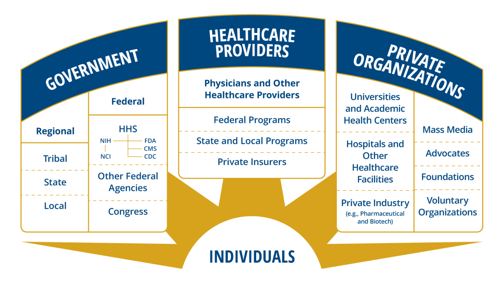

<left-top-navigation root="/about/"></left-top-navigation>

<h2 class="post-title">About the President's Cancer Panel</h2>
The President's Cancer Panel monitors the activities of the National Cancer Program
and reports to the President of the United States on barriers to progress in reducing
the burden of cancer.

The Panel accomplishes its mission by identifying high-priority topics for which
actionable recommendations can be made, convening meetings with key experts and
stakeholders to develop an understanding of the problems, challenges, opportunities,
and potential solutions and then framing possible recommendations, including actions
that should be taken by relevant organizations. Following substantial input, the Panel
submits a report to the President of the United States.

The Panel communicates its findings using a variety of tools—including print and
web-based reports, social media, and presentations to a range of organizations.
While reports are to the President, they are also for the larger group of stakeholders,
public and private, that form the National Cancer Program as well as other partner
organizations. Together, these organizations and others can make a positive difference
in accelerating progress against cancer.

